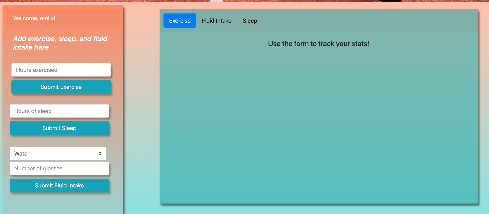

# projectYOU

## Description

This is a full-stack application, utilizing Node.js, Express.js, MySQL, Sequelize, Express Handlebars, a database, and Heroku. This is projectYOU, a simple tracker for anyone to log their minutes of exercise, glasses of water, and hours of sleep all in one place. User information is created upon sign up and stored in a database, which is updated as the user logs their health milestones.

Link to project: https://projectyou.herokuapp.com/

## Table of Contents

- [Installation](#installation)
- [Usage](#usage)
- [Credits](#credits)
- [License](#license)

## Installation

New users may sign up on the home page, submitting a username, password, first name, and last name. After signing up successfully, users may sign in on the left side of the home page.

## Usage

Once signed in, user will view their profile page. This shows their current exercise, fluid intake, and sleep stats. They may choose to enter in new information: hours exercised, hours slept, or glasses of water/sports drink/juice. Upon submit, this information is stored in the database and the page refreshes to show updated information.

## Credits

Shout out to TA Chris for his patient assistance!

Collaborators: <a href="https://github.com/jawalton6616">Jacob Walton</a>, <a href="https://github.com/wslifer">Wesley Slifer</a>, <a href="https://github.com/hansbrougha">Andrew Hansbrough</a>, <a href="https://github.com/ewirtz3">Emily Wirtz</a>

Third-Party Assets Used: Sequelize, Express, Express Handlebars, Morgan, MySQL2, Node, Heroku

## License

MIT License Copyright(c) 2020 group 1
